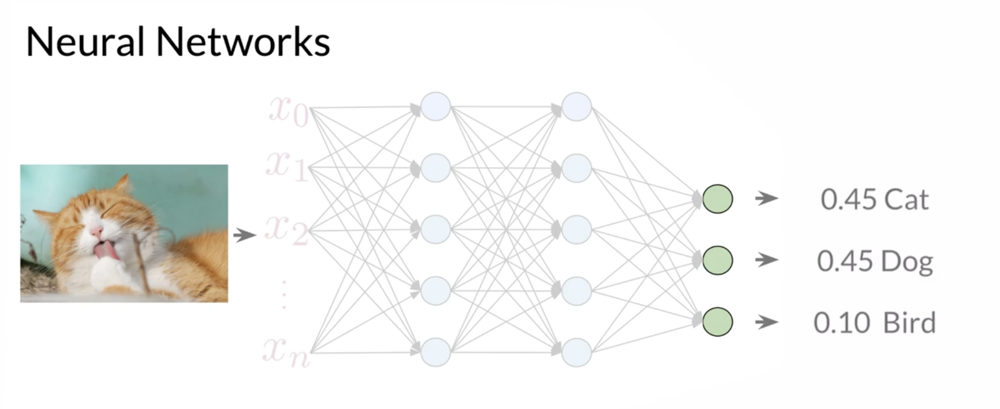
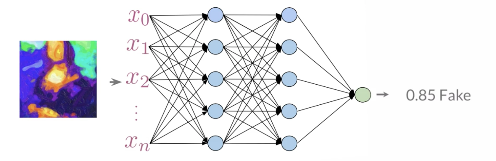
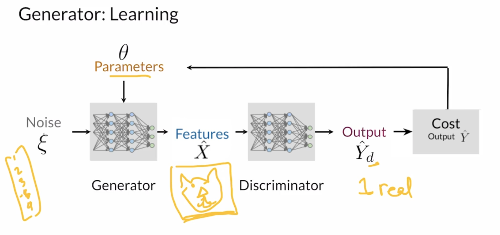
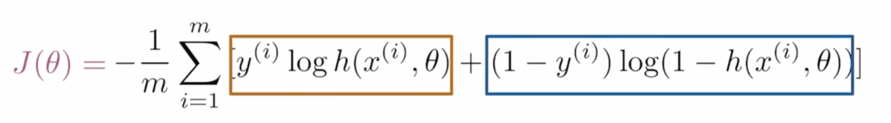

# GANs
[toc]
## Course 1: Build Basic Generative Adversarial Network
### week 1
#### Generative models

1. Variational Autoencoders
2. Generative Adversarial Networks(GANs)
which one is real and which one is fake.
then the discriminators are not used any more
- Generative models learn to produce realistic examples
- Discriminative model distinguish between class (real and fake)

#### GANs
##### Real life GANs
Nothing to say here

##### Intuition Behind GANs
two different NN
- generator learn L what direction
- discriminator learn how to distinguish the real one and fake one

##### Discriminator Generator
**Discriminator:**

1. Features X
2. Labels Y
3. parameters theta
4. Output Y_hat
5. Cost

P(Y|X)
how fake this image is?
P(fake|features) = ?
and the probabilities are the feedback for the generator


Generator

learning: 

P(features|class)

P(features)

- the generator produces fake data
- it learns the probability of features X
- The generator takes as input noise(random features).

##### BCE Cost Function
for binary classification (real and fake)

Same as what I used before, m is the number of training data(samples), y is the true value, h is the output value(prediction), where x(i) is the input and $\theta$ are parameters.


1. BCEWithLogitsLoss Function:

    ```python
    torch.nn.BCEWithLogitsLoss(weight=None, size_average=None, reduce=None, reduction='mean', pos_weight=None)
    # This loss combines a Sigmoid layer and the BCELoss in one single class. This version is more numerically stable than using a plain Sigmoid followed by a BCELoss as, by combining the operations into one layer, we take advantage of the log-sum-exp trick for numerical stability.
    # here is an example of BCEWithLogitsLoss
    >>>from torch import nn
    >>>loss = nn.BCEWithLogitsLoss()
    >>>input_tensor = torch.randn(3, requires_grad=True)
    >>>target = torch.ones(3)
    >>>output = loss (input_tensor, target)
    >>>print (input_tensor)
    >>>print (target)
    >>>print (output)
    tensor([-0.0988,  0.0621,  0.4736], requires_grad=True)
    tensor([1., 1., 1.])
    tensor(0.6302, grad_fn=<BinaryCrossEntropyWithLogitsBackward>)

    # same result as:
    def sigmoid(output_tensor):
        return 1/(1 + torch.exp(-output_tensor))

    def bce_loss(output_tensor, target_tensor, sigmoid):
        return - torch.mean(target_tensor * torch.log(sigmoid(output_tensor)) + (1 - target) * torch.log(1 - sigmoid(output_tensor)))

    >>> print (bce_loss(input_tensor, target, sigmoid))
    tensor(0.6302, grad_fn=<NegBackward>)
    ```

get generator loss:

```python
fake noise = get noise (input)
fake image = generator(fake noise)
fake disc pred = disc (fake image)

```

```python
torch.ones_like(tensor)
# return a tensor with all value is 1, and same dimension as input tensor
# example:
>>> a = torch.randn(2,2)
>>> b = torch.ones_like(a)
>>> print (a)
>>> print (b)
tensor([[ 0.6929, -0.1867],
        [ 0.9191,  0.5472]])
tensor([[1., 1.],
        [1., 1.]])
```

```python

```


```python
```
##### Putting all together
1. the generator and discriminator should be on the same stage(training stage, 100% won't tell generator how to improve)
- GANs train in an alternating fashion
- The two models should always be at a similar "skill" level.
- kjl
- 