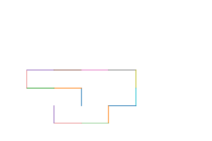

## Gans for generating configuration of polymer
### build my dataset
#### figure out the pattern of generator's output
1. option 1: convert the coordinate information to image, for example the first one can be represented by:
   
2. option 2: directly output the coordinates, which is a [16 * 2] matrix
3. option 3: process the coordinate first, the useful information is the direction of each step, and step size is always
   1. So the output of the generator should be a [15 * 1] vector. where it start from doesn't matter. I perfer this way,
    basically, the image are 3 dimensions information, which is perfectly fit with the ising model (coordinate[2d], spin
      [1d]), but for our porject, I think only direction matter
      
#### establish the dataset 